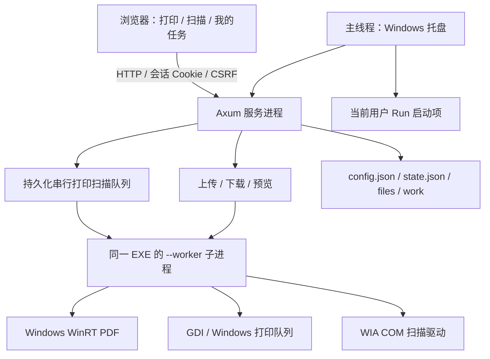

# 架构说明

适用版本：0.1.0，Windows / macOS / Linux。办公室主机运行 LanPrint，同事使用现有浏览器。网页通过 `include_str!` 编译进程序；修改网页后必须重新构建。`platform.rs` 根据目标选择 `windows.rs` 或 `unix.rs`；后者调用 CUPS、Poppler、SANE 和可选 LibreOffice，工作进程使用独立进程组，取消或超时会结束整个工具进程组。平台功能、依赖和数据目录见 [CROSS-PLATFORM.md](CROSS-PLATFORM.md)。下图展示 Windows 分支。

## 模块职责

| 文件 | 职责与修改入口 |
| --- | --- |
| `src/main.rs` | 区分服务与子进程入口、主机错误对话框 |
| `src/server.rs` | 参数解析、HTTP 安全、上传与会话、设备缓存、任务执行和关闭 |
| `src/model.rs` | 配置、设备、任务、打印扫描选项及输入校验 |
| `src/store.rs` | JSON 原子替换、文件归属、幂等、重启恢复和清理 |
| `src/worker.rs` | JSON 子进程协议、超时、演示设备与样张 |
| `src/platform.rs` / `src/windows.rs` | WinRT PDF、GDI、WIA、托盘、进程退出和文件锁 |
| `src/startup.rs` | 当前用户登录启动注册、Windows 参数引号、独立实例标识 |
| `src/firewall.rs` | Windows 防火墙 COM 规则检查、端口诊断、有限范围的 UAC 提权修复 |
| `web/` | 无构建工具的 HTML/CSS/JS，HTTP 轮询任务 |
| `scripts/` | 构建、浏览器集成测试、跨电脑兼容性检测 |

## 数据流与正确性

上传流式写入 UUID 文件 → 子进程检查真实内容/页数 → 配额检查 → 保存文件元数据。文件名仅用于展示，磁盘路径由服务端生成。处理中失败/取消会尝试清理，启动时清理未入库 UUID 文件。

提交先以 `(owner, request_id)` 查找已接收任务，同类型重试直接返回原结果，不因文件过期、设备离线或配额变化而报错；跨打印/扫描复用同一标识会被拒绝。新请求校验文件归属、设备能力及配额后入队。队列在调用设备之前保存 `running`，避免保存失败仍消耗纸张。状态变化为 `queued → running → submitted / completed / simulated / failed`；仅 `queued` 可变为 `cancelled`。重启时所有活动任务改为 `interrupted`，绝不自动重放。`submitted` 只代表提交 Windows 打印队列。

扫描单页生成 PDF/JPG/PNG，保存成功后把文件关联到原会话。上传和扫描统一检查空间及 1000 个文件的数量上限，保存失败回滚内存记录。每个设备任务启动新子进程；打印和扫描串行执行，上传/预览共享 3 个重型操作许可。下载按块读取文件并随客户端接收速度发送，不再整文件载入内存。设备列表缓存 30 秒。设备枚举 25 秒、文件检查/预览 30 秒、打印 180 秒、扫描 120 秒超时。

子进程在独立 `work/<UUID>` 目录生成输出，成功后才原子移动到目标路径；失败或超时先等待子进程退出，再清理临时目录。请求被取消时，独立监督任务仍负责结束子进程并清理，未完成输出不会发布。上传原文件清理仍为尽力执行，崩溃残留在下次启动时清理。

子进程使用请求/响应 JSON，主进程检查退出码和响应 `error`。不成功不自动重试打印。子进程完成资源析构、写出结果后使用 `TerminateProcess` 退出，以避开曾在本机出现的系统 PDF/显卡 DLL 卸载崩溃；这不是按 AMD 型号分支的修补，也不能修复渲染中途的驱动故障。修改退出顺序时必须重新运行原生 PDF 测试。

## 存储与隔离

数据根目录默认 `%LOCALAPPDATA%\LanPrint`，演示默认 `LanPrint-demo`；`--data-dir` 可覆盖。`config.json` 存端口、配额、保留时间和随机签名密钥；`state.json` 存文件元数据和任务；`files` 存用户文件；`work` 存子进程中间文件。`instance.lock` 的独占句柄阻止同一数据目录重复运行。

JSON 通过临时文件、刷盘、Windows 原子替换保存。当前没有数据库 schema 版本或迁移器，不能假定未来版本可直接双向读取。启动不会自动覆盖损坏的状态文件。整个目录需在程序退出后备份。

Cookie 经 HMAC 签名，写请求校验 CSRF 和 Origin，连接地址与 Host 受内网限制，文件和任务按浏览器会话隔离。HTTP 不加密、无员工账户；主机管理员能读文件。当前监听 IPv4 `0.0.0.0`，部署在可信专用网络，不支持直接公网暴露。

## 本机实用设置

自动启动仅从托盘操作，注册到 `HKCU\Software\Microsoft\Windows\CurrentVersion\Run`，值名为 `LanPrint-` 加数据目录哈希。命令含完整 EXE、数据目录、`--background`、演示标志及显式端口覆盖；无显式覆盖则使用配置端口。默认关闭，不创建系统服务。启动项不在 JSON 内，Windows 可另行禁用它。

防自动睡眠由托盘线程调用 `SetThreadExecutionState`，本次运行生效，默认关闭，退出释放；允许屏幕熄灭，不阻止用户手动睡眠、关机、合盖策略或企业电源策略。

## 后续扩展约束

新增设置需同步默认值、校验、文档和老配置读取测试。新增任务状态需同步队列恢复、网页展示和幂等行为。新增 PDF 后端应在 worker 内统一实现页数/预览/打印渲染接口，并以同一测试集验证；不要只替换预览导致打印内容不同。多页扫描需设计页数/时限/取消、ADF 缺纸处理与结果清理，不能直接无限循环单页扫描。无人登录运行需独立服务架构，先验证 Session 0、用户打印机与 WIA 驱动，不应仅给现有程序套服务启动器。
